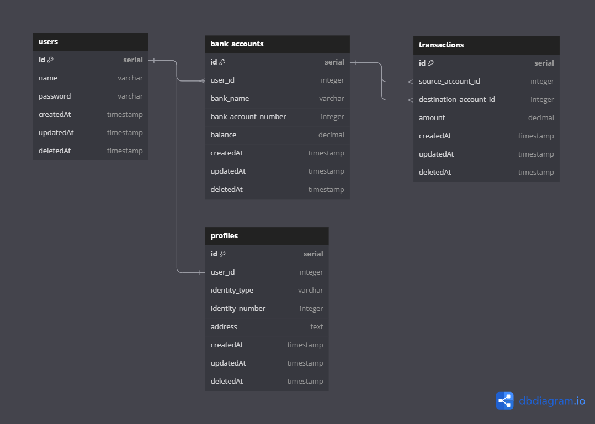

## Project Setup
Clone the project from GitHub repository :

      git clone https://github.com/fajarutamaa/banking-system-api.git
      
change directory :

      cd banking-system-api

Install all package dependencies :

      npm install

Compile and hot-reload for development :

      npm run dev

Unit testing for development :

      npm test

## Environment Variables Settings

There is a required environment variable that needs to be set in `.env`
submit:

- PORT

  Port address to provide access to localhost for development purposes. You can assign a port address according to the available port, such as 8000, 8080 or etc.

  
- DATABASE_URL
  
  Database URL credentials to provide access to the Database. You can contact the administrator to get the adrress url.

- SALT_ROUNDS
  
  Salt rounds typically refers to a security concept related to password hashing. When storing passwords in a database, it's essential to hash them securely to protect user credentials. One common approach is to use a one-way cryptographic hash function. However, using just a hash function can be vulnerable to attacks like rainbow table attacks, where attackers precompute the hashes for many possible passwords and compare them to the stored hashes.

- SECRET_KEY
  
  SECRET_KEY is a variable often used in the context of JSON Web Tokens (JWTs). A JSON Web Token is a compact and self-contained way to represent information between two parties. It is commonly used for authentication and authorization in web applications and APIs.

## Tech Stack
- [x] Express Js
- [x] Jest
- [x] Supertest
- [x] Prisma
- [x] PostgresSQL 16
- [x] PgAdmin V7
- [x] Postman
- [x] Visual Studio Code
- [x] DBDiagram
- [x] Swagger

## Entity Relationship Diagram

      
## Reference
[Installation](https://www.npmjs.com/package/express) | [API Reference](https://expressjs.com/en/4x/api.html#app) | [Prisma Documentation](https://www.prisma.io/docs/concepts/overview/what-is-prisma) | [Swagger Documentation](https://swagger.io/)

## License
MIT

